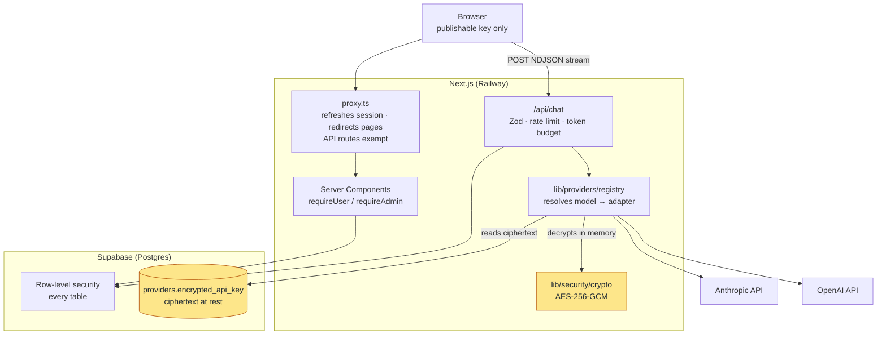

# myaichat

Multi-provider AI chat SaaS — streaming chat, an admin panel for provider keys and models,
and per-user theming. Built on Next.js 16 (App Router), Supabase, and Tailwind.

Current status lives in [docs/wiki/PROGRESS.md](docs/wiki/PROGRESS.md).
How it fits together — with diagrams — is in [docs/ARCHITECTURE.md](docs/ARCHITECTURE.md).
Full requirements are in [docs/00-PROJECT-SPEC.md](docs/00-PROJECT-SPEC.md).

## Requirements

- Node 18+ (developed on 24)
- A Supabase project
- Docker is **not** required — migrations run against the hosted database
  (see [DEC-004](docs/wiki/DECISIONS.md))

## Local setup

```bash
npm install
cp .env.example .env.local   # then fill in your Supabase values
npm run dev
```

### Environment

Every variable is documented in [.env.example](.env.example). The four needed to boot:

| Variable | Where to find it |
|---|---|
| `NEXT_PUBLIC_SUPABASE_URL` | Supabase → Project Settings → Data API |
| `NEXT_PUBLIC_SUPABASE_ANON_KEY` | Project Settings → API Keys → publishable (`sb_publishable_…`) |
| `SUPABASE_SERVICE_ROLE_KEY` | Project Settings → API Keys → secret (`sb_secret_…`) — **server only** |
| `SUPABASE_DB_PASSWORD` | Project Settings → Database — used by the CLI for `db push` |
| `ENCRYPTION_MASTER_KEY` | Generate: `openssl rand -base64 32` — see the warning below |

> **`ENCRYPTION_MASTER_KEY` is unrecoverable.** Every provider API key in the database is
> encrypted with it. Lose it and they all have to be re-entered; rotating it means
> re-encrypting every stored key. The same value must be set in Railway at deploy time.

> This project uses Supabase's **new** API key format (`sb_publishable_` / `sb_secret_`), not
> legacy `anon` / `service_role` JWTs. They are opaque strings — never decode them as JWTs.
> The variable names are legacy-styled on purpose; see [DEC-003](docs/wiki/DECISIONS.md).

## Database

Migrations live in [supabase/migrations/](supabase/migrations/) and apply to the hosted project.

```bash
npm run db:push      # apply pending migrations
npm run seed         # create the first admin user + default settings
npm run keys:encrypt # move provider keys from .env.local into encrypted DB storage
```

`npm run seed` needs `SEED_ADMIN_EMAIL` and `SEED_ADMIN_PASSWORD` in `.env.local`. It is
idempotent — safe to re-run.

`lib/db/types.ts` is hand-maintained because `supabase gen types` needs Docker. **If you change
a migration, update that file in the same commit.**

## Verification

```bash
npm run lint
npm run type-check
npm run build

npm run verify:schema   # every table/view/function exists
npm run verify:rls      # users cannot reach each other's data
npm run verify:seed     # exactly one admin, settings intact
npm run verify:gates    # route gates (needs `npm run dev` running)
npm run verify:chat     # streaming, persistence, stop, XSS (needs `npm run dev`)
npm run verify:providers # abstraction holds, both providers stream (needs `npm run dev`)
npm run verify:admin    # encryption, admin gates, suspension (needs `npm run dev`)
```

`verify:gates` defaults to `http://localhost:3000`; override with `BASE_URL=http://localhost:3001`.
The verify scripts create throwaway users and delete them afterwards.

## Architecture notes

Three Supabase clients, and the distinction matters:

| Module | Key | RLS |
|---|---|---|
| [lib/db/client.ts](lib/db/client.ts) | publishable | enforced |
| [lib/db/server.ts](lib/db/server.ts) | publishable, cookie-bound | enforced |
| [lib/db/admin.ts](lib/db/admin.ts) | **secret** | **bypassed** |

`admin.ts` is marked `server-only`, so importing it from a Client Component is a build error.

Security posture:

- RLS on every table; `usage_logs` and `audit_logs` are read-only to clients and written server-side
- `providers.encrypted_api_key` is protected by **column-level grants**, not RLS — RLS is
  row-level and cannot hide a column. Clients read [`providers_public`](supabase/migrations/) instead.
- `profiles.role` is pinned by a trigger, so a user cannot promote themselves
- Route protection is layered: `proxy.ts` redirects, and every protected page re-checks
  server-side. Middleware is a convenience gate, not the boundary.

## Adding a new AI provider

One adapter file in [lib/providers/](lib/providers/) implementing `ChatProvider`, one line
in the registry, and database rows. No route or UI changes. Full instructions and the
vendor differences the abstraction absorbs: [lib/providers/README.md](lib/providers/README.md).

`npm run verify:providers` enforces this with `git grep` — no vendor SDK import and no
provider name may appear outside `lib/providers`.

## Architecture



**The key path is the part worth understanding.** A provider key is stored only
as ciphertext. `registry.ts` reads it, decrypts it with the master key from the
environment, and hands the plaintext to an adapter instance — which lives for one
request. No key ever crosses into a client bundle, and every module on that path
imports `server-only`, so an accidental client import fails the build rather than
leaking.

## Deployment

Live at `myaichat-production.up.railway.app`, deploying from `main`.

**Environment variables** — set these in Railway (Variables → Raw Editor):

```
NEXT_PUBLIC_SUPABASE_URL
NEXT_PUBLIC_SUPABASE_ANON_KEY
SUPABASE_SERVICE_ROLE_KEY
ENCRYPTION_MASTER_KEY
NEXT_PUBLIC_APP_URL
```

Provider API keys are **not** among them — those live encrypted in the database
after Phase 4.

> `ENCRYPTION_MASTER_KEY` must match the value used to encrypt the stored keys,
> character for character. A different value means production cannot decrypt them.

**Health check:** `/api/health` returns 200 only when the database is reachable
*and* the encryption key is present. It deliberately checks dependencies rather
than returning a bare "ok" — a process that is up but cannot reach its database
is not healthy, and a check that says otherwise makes a broken deploy look
successful.

**Migrations** are promoted with `npm run db:push`, which applies any pending
files in `supabase/migrations/` to the linked project. There is currently one
Supabase project for local and production (ISSUE-015).

**CI** runs lint, type-check, formatting, build and the credential-free test
suites on every PR. The Railway deploy job in `.github/workflows/ci.yml` is
disabled on purpose — Railway deploys from GitHub directly, and enabling both
would produce two racing deployments per merge. The comment in that file explains
how to switch.

## Project layout

```
app/(auth)/      login, signup, auth server actions
app/(app)/       protected shell, chat root, /admin
lib/db/          Supabase clients, session refresh, generated-ish types
lib/security/    auth gates, Zod schemas
lib/providers/   LLM adapters (Phase 3)
lib/r2/          object storage (Phase 6)
emails/          Resend templates (Phase 6)
scripts/         seed + verification scripts
supabase/        migrations
docs/wiki/       progress, issues, decisions, roadmap
```
