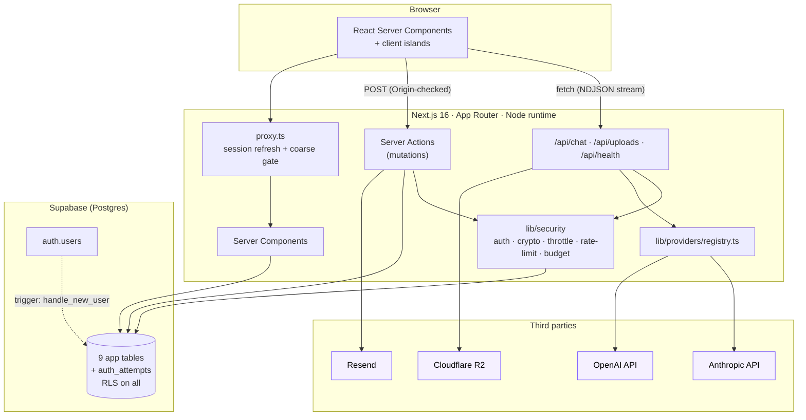
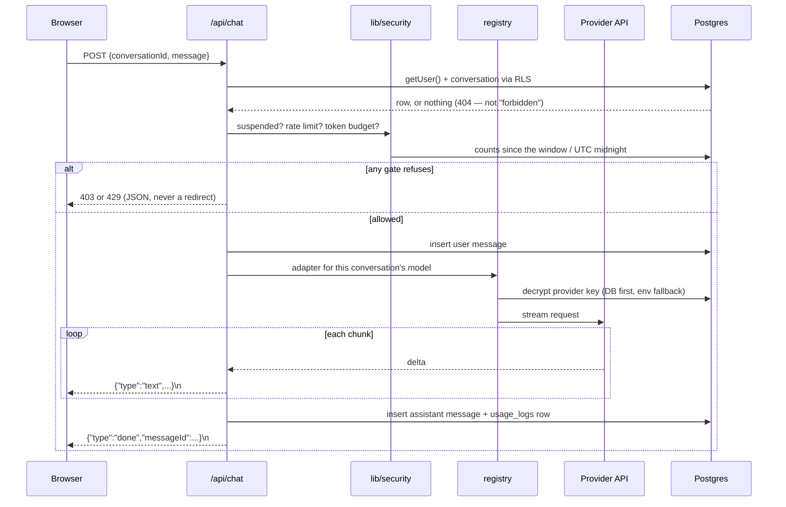
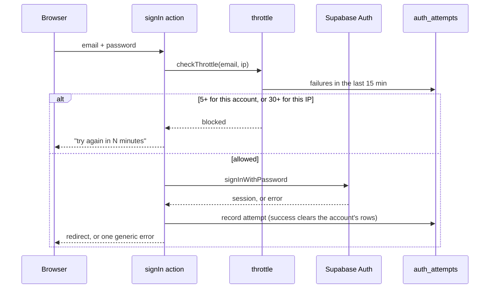
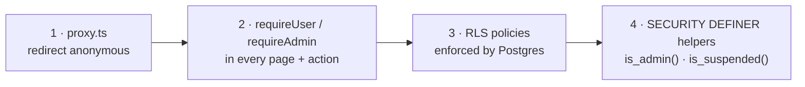
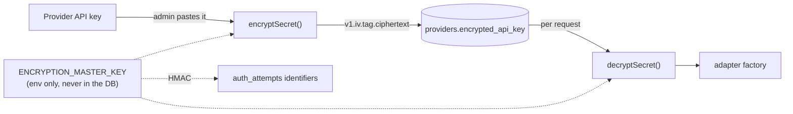
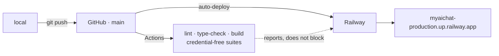

# Architecture

How myaichat is put together, and — more usefully — why the non-obvious parts
are the way they are. Anything here that reads as a strange choice has a reason
recorded next to it or in [wiki/DECISIONS.md](wiki/DECISIONS.md).

- [The shape of it](#the-shape-of-it)
- [Request paths](#request-paths)
- [Data model](#data-model)
- [The four authorisation layers](#the-four-authorisation-layers)
- [Secrets](#secrets)
- [Theming](#theming)
- [Verification](#verification)
- [Deployment](#deployment)

---

## The shape of it



Three things about this drawing are load-bearing:

**Only `lib/providers` touches a vendor SDK.** The chat route asks the registry
for an adapter and streams whatever comes back; it names no vendor and imports
no vendor package. `npm run verify:providers` greps the tree to prove it, because
two providers both working is not evidence — an `if/else` in the route would
pass that test and fail this one.

**Mutations are Server Actions, not route handlers.** Next verifies the `Origin`
header before a Server Action body runs, which is the CSRF control. A mutation
exposed as a plain `POST` route would need that written by hand, so none are.

**`proxy.ts` is a convenience, not a boundary.** It refreshes the session cookie
and redirects anonymous visitors early. Every page and action re-checks
server-side anyway — see [the four layers](#the-four-authorisation-layers).

---

## Request paths

### A chat message



**Wire format is NDJSON, not SSE.** The request has to be a POST — the body
carries the conversation and message — and `EventSource` cannot POST. NDJSON is
two lines to parse from a `fetch` reader.

**A conversation belonging to someone else 404s rather than 403s.** The query
runs through the user's own client, so RLS returns no row; there is nothing to
distinguish "not yours" from "does not exist", which is the intent.

**Ordering matters.** The user's message is written *before* the provider is
called, so an interrupted stream leaves a question with no answer rather than
losing the question. The `usage_logs` row is written after completion, which is
why the daily budget is a ceiling rather than an exact meter — see
`lib/security/token-budget.ts`.

### Signing in



The error is deliberately identical for "no such account" and "wrong password".
Distinguishing them tells an attacker which addresses are registered.

---

## Data model

```mermaid
erDiagram
    auth_users ||--|| profiles : "trigger on signup"
    auth_users ||--o| user_preferences : has
    auth_users ||--o{ conversations : owns
    auth_users ||--o{ usage_logs : generates
    auth_users ||--o{ audit_logs : "acts in"
    conversations ||--o{ messages : contains
    providers ||--o{ models : offers
    models ||--o{ conversations : "selected for"
    models ||--o{ usage_logs : "billed to"

    providers {
        text name PK_unique
        text encrypted_api_key "AES-256-GCM, never leaves the server"
        text key_last4 "display only"
        boolean enabled
    }
    models {
        uuid provider_id FK
        text model_id "the vendor's string"
        numeric input_cost_per_1k
        boolean enabled
    }
    profiles {
        uuid id PK "= auth.users.id"
        user_role role "'user' | 'admin'"
        boolean suspended
    }
    system_settings {
        text key PK
        jsonb value "NOT NULL — see ISSUE-008"
    }
    auth_attempts {
        text identifier "HMAC of email or IP, never raw"
        text kind "'login' | 'reauth'"
    }
```

Two notes:

**`providers.encrypted_api_key` is not protected by RLS**, because RLS is
row-level and cannot hide a column. `SELECT` on `providers` is revoked from
`authenticated` entirely, and a `providers_public` view exposes the safe columns.
The encrypted key is reachable only through the service-role client.

**`system_settings.value` is `jsonb NOT NULL`.** A JavaScript `null` becomes SQL
`NULL` and violates that constraint — which is how the seed script crashed on
day one (ISSUE-008). Settings with no value are omitted, not written as null.

---

## The four authorisation layers



Each layer assumes the ones before it may be bypassed:

1. **`proxy.ts`** — coarse and fast. Never the boundary; API routes are exempted
   from its redirect entirely, because a `fetch` expecting JSON that silently
   follows a 307 into an HTML login page reports success (ISSUE-011).
2. **`requireUser()` / `requireAdmin()`** — in every page and every Server
   Action. `npm run verify:authz` reads the source to prove none was forgotten.
3. **RLS** — on all ten public tables. Even a bug that reached the database with
   the wrong user's id cannot read another user's rows.
4. **`SECURITY DEFINER` helpers** — `is_admin()` and `is_suspended()` exist
   because a policy *on* `profiles` that queries `profiles` recurses infinitely.
   That bug (ISSUE-007) blocked every profile edit and **passed its first test**,
   because a blocked update and a crashed update both return zero rows. Tests
   here assert stored state, never response shape.

High-value actions add a fifth check: writing or deleting a provider key
re-verifies the admin's password server-side, so a stolen session alone is not
enough.

---

## Secrets



AES-256-GCM, format `v1.<iv>.<tag>.<ciphertext>`. The version prefix means a
future algorithm change can read both formats and re-encrypt on write, rather
than needing a flag day. GCM is authenticated, so a tampered value throws instead
of decrypting to garbage. A fresh random IV per encryption — reusing one under
the same key breaks GCM catastrophically.

Keys are decrypted per request rather than cached, which is why adapters are
factories taking a key rather than singletons: a cached adapter would hold a key
that may since have been rotated.

---

## Theming

Seven presets × light/dark, resolved with **zero flash**. Both token blocks are
server-rendered, and a tiny inline script resolves `system` against the OS
setting before first paint. The cost is `'unsafe-inline'` in the CSP's
`script-src` — a nonce cannot be applied to that script without reintroducing
the flash. The trade is documented at the top of `next.config.ts` and remains an
open decision.

`npm run verify:theme` computes WCAG AA contrast for every token pairing in every
theme in both modes (134 checks) directly from the token data, so a new preset is
checked automatically rather than needing a new test.

---

## Verification

There is no unit-test framework. Every check is a script that exercises the real
database, the real server or the real source, because the bugs this project has
actually hit were not the kind a mocked unit test catches.

| Script | What it proves | Needs |
|---|---|---|
| `verify:schema` | every table, view and function exists | DB |
| `verify:rls` | user A cannot read or write user B's rows | DB |
| `verify:gates` | anonymous and non-admin redirects | server |
| `verify:authz` | **no action or route was shipped without a gate** | — |
| `verify:headers` | the security header config | — |
| `verify:theme` | WCAG AA across every theme | — |
| `verify:appearance` | the theme is in the server-rendered HTML | DB + server |
| `verify:providers` | no vendor SDK or name escaped `lib/providers` | DB + keys |
| `verify:admin` | breaking **only the DB key** breaks chat — no silent env fallback | DB |
| `verify:security` | throttling, password rules, rate limit, token budget | DB |
| `verify:chat` | a real streamed completion end to end | DB + keys |
| `verify:email` | email templates render and meet contrast | — |
| `security:audit` | secret-shaped strings, advisories, RLS from the **pg catalog** | DB |
| `smoke` | a *running deployment*: headers as served, gates, assets | server |

The pattern worth copying: **assert stored state, not response shape**. Several
real bugs here produced responses indistinguishable from success.

---

## Deployment



CI and the deploy are **not chained**: Railway watches GitHub directly, so a red
build reports but does not prevent a deploy. Closing that needs branch
protection, which needs a paid plan on a private repository (ISSUE-018). The
workflow contains a Railway deploy job, deliberately disabled (`if: false`), with
the three steps to switch over written in place.

The build must not require runtime credentials — env parsing is lazy for exactly
this reason, and `env -i npx next build` is how that stays true (ISSUE-014).
